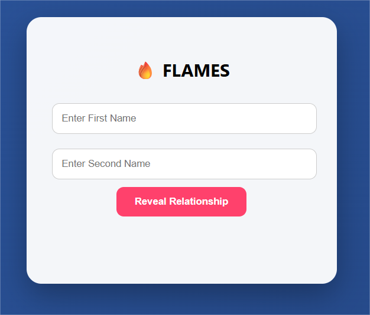

# 🔥 FLAMES — From Childhood Memories to Code



An interactive web application that reimagines the classic FLAMES game with a modern UI and dynamic emoji animations.

🌐 **Live Demo:**  
👉 https://sainikith07.github.io/Flames/


---

## 🌸 Inspiration

Remember those school days?

Passing notebooks...  
Writing two names secretly...  
Striking out common letters...  
Counting **F L A M E S**...

This project transforms that nostalgic memory into a responsive web experience built using frontend technologies.

---

## 💡 What Makes This Special

- ✔ Animated gradient background  
- ✔ Dynamic emoji background based on result  
- ✔ Smooth result animation  
- ✔ Fully responsive design  
- ✔ Pure frontend logic (No backend required)  
- ✔ Deployed using GitHub Pages  

### 🎭 Result-Based Emoji Themes

- 💍 **Marriage** → 💍 ❤️ ✨  
- ❤️ **Love** → ❤️ 💖 💘  
- 🤝 **Friends** → 🤝 ⭐ 😊  
- 🥰 **Affection** → 🌸 💛 🥰  
- 😡 **Enemies** → 🔥 ⚡ 😡  
- 👨‍👩‍👧 **Siblings** → 💙 🌟 👨‍👩‍👧  

---

## 🧠 Algorithm Overview

1. Convert both names to lowercase  
2. Remove spaces  
3. Cancel out common characters  
4. Count remaining unmatched characters  
5. Perform circular elimination on:

   ```
   F L A M E S
   ```

6. The last remaining letter determines the relationship  

**Simple logic. Clean implementation. Interactive output.**

---

## 🛠 Tech Stack

- **HTML**
- **CSS** (Animations + Gradient UI)
- **JavaScript** (Logic + DOM Manipulation)
- **GitHub Pages** (Deployment)

---

## 🚀 How To Run Locally

1. Clone the repository  
2. Open `index.html` in your browser  

No installation required.

---

## 📌 Author

**Sai Nikith**

- GitHub: https://github.com/sainikith07  
- Live App: https://sainikith07.github.io/Flames/

---

If you like this project, feel free to ⭐ the repository.
